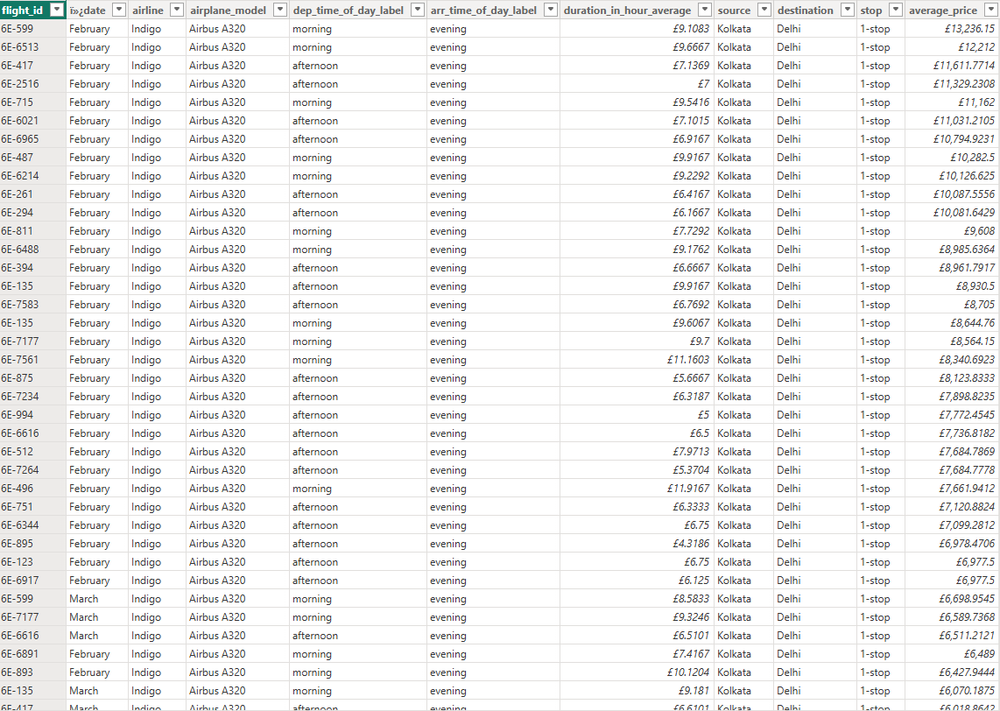

## 📌 Project Overview
This project focuses on transforming a raw dataset into a structured model ready for analysis using Power BI.  
While many dashboards are built from clean data, real-world datasets are often messy. The goal of this project was to demonstrate how to use **Power Query** and **DAX** in Power BI to clean, model, and prepare data for reporting.  

---

## 🗂 Dataset
The dataset provided included inconsistencies such as:  
- Mixed data types (numbers stored as text, dates unformatted)  
- Missing/duplicate entries  
- Unstructured flight/destination information  

---

## 🔎 Transformation Process

### 1. Raw Dataset (Before)
  
*Unstructured data with incorrect formats and duplicates.*

---

### 2. Transformation Steps
A few key transformations performed in **Power Query**:
- Converted dep_time and arr_time (eg. 02:24) to time label format (eg. 'morning') 
- Split airline details into **airline / airplane**  
- Cleaned missing values and removed duplicates  
- Standardized Date format  
- Created calculated columns and measures using **DAX**  

Example step:  
  
*I transformed the dep_time column into time-of-day categories by converting it to whole numbers, dividing with DAX, and applying IF-ELSE logic to label each period.*  

---

### 3. Cleaned Dataset (After)
  
*Structured dataset ready for analysis and modeling.*  

---

## 📐 Data Model
  
*Star schema built in Power BI, with fact and dimension tables connected.*  

---

## 📊 (Bonus) Summary Dashboard
  
*A simple validation dashboard showing record counts and summary sales figures after cleaning.*  

---

## 🔎 Key Transformations & Insights
- Transformed `dep_time` into categorical labels using DAX & IF-ELSE logic, allowing segmentation by time of day.  
- Merged the *routes* and *flights* tables to enrich flight records with route metadata.  
- Grouped by destination, airline, and time of day, aggregating average duration and average price for each grouping.  

## 📈 What This Enables
- Enables comparison of flight performance across different times of day and airlines.  
- Helps identify which airline models and routes are more cost-effective based on average price vs. duration metrics.  
- Lays groundwork for predictive analytics (e.g., predicting delays or optimizing routes) using clean, structured data.  

---

## 🔑 Skills Demonstrated
- Data Cleaning & Transformation in Power BI (Power Query Editor)  
- Handling inconsistent data types, duplicates, and missing values  
- Merging multiple tables into a structured dataset  
- Grouping and aggregating columns (e.g., average duration, average price)  
- Building simple data models with relationships between tables  
- Creating calculated columns and basic DAX measures  
- Preparing datasets for future dashboarding and analysis  
- Clear documentation of the data preparation process

---

## 🚀 How to Use
- Download the `.pbix` file from this repo.
- Open it with **Power BI Desktop** (free from Microsoft).

---
